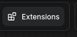
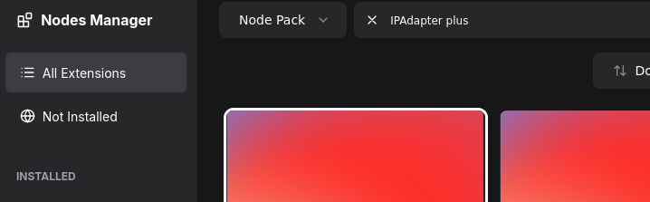

Basics of ComfyUI User Interface
----------------------------------------------------

### Node Manager

 En ComfyUI, en menú flotante de la derecha, abrir **Manager** (**"Extensions"** menú) -asume ComfyUI-Manager instalado-. 
			
	2. Hacer click en botón **Install Custom Nodes**.
	3. En el cuadro de búsqueda superior, escribe exactamente: `IPAdapter plus`.
	
	